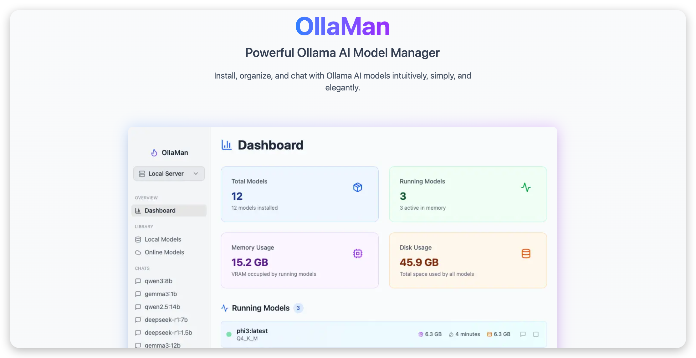

# OllaMan - Professional Ollama AI Model Manager

## Overview

OllaMan is an elegant desktop application that makes managing Ollama AI models simple and intuitive. With a beautiful interface designed for modern desktops, it provides everything you need to discover, install, and chat with AI models effortlessly.

## 🚀 Get Started

1. **Download** the app from [ollaman.com](https://ollaman.com)
2. **Install** following the simple setup guide
3. **Connect** to your Ollama server
4. **Start chatting** with AI models right away

## 🚀 Key Features

### **Smart Model Management**
- **Browse & Organize**: View all your installed models with detailed information
- **Discover New Models**: Search thousands of models from Ollama's library
- **One-Click Install**: Download any model with a simple click
- **Smart Categories**: Models automatically organized by type and size

### **Powerful Chat Experience**
- **Real-Time Conversations**: Instant responses as the AI generates text
- **Performance Insights**: See how fast your models are running
- **Chat History**: Save and revisit your conversations anytime
- **Share Results**: Create beautiful cards to share model performance

### **Multi-Server Support**
- **Multiple Connections**: Connect to different Ollama servers
- **Easy Switching**: Switch between servers instantly
- **Health Monitoring**: Always know if your servers are running properly

### **Visual Dashboard**
- **System Overview**: See all your models and usage at a glance
- **Resource Monitoring**: Track memory usage and running models
- **Performance Charts**: Visual insights into your AI usage

## 🎯 Why Choose OllaMan

### **Beautiful & Intuitive**
- Clean, modern interface that feels natural to use
- Dark mode support for comfortable viewing
- Designed to work perfectly on any screen size

### **Fast & Reliable**
- Instant updates and smooth performance
- Smart resource management keeps everything running smoothly
- Automatic updates ensure you always have the latest features

### **Privacy First**
- All your data stays on your device
- No tracking or data collection
- Complete control over your AI conversations

## 📋 Cross-Platform Support

Available for **macOS**, **Windows**, and **Linux** - works seamlessly on all major desktop platforms.

